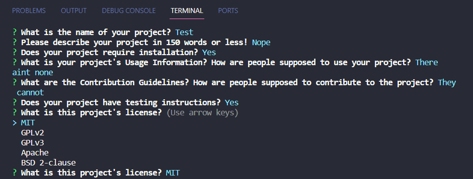

# READMEMaker by Alan Lee

## Table of Contents

[Description](#description)

[Installation](#installation)

[Usage Information](#usage-information)

[Testing Instructions](#testing-instructions)

[Deployed Website](#deployed-website)

[Questions?](#questions?)

[Contributing](#contributing)

[License](#license)

## Description 
This project is designed to allow you to create a professional readme using command line prompts! In fact this very readme for this github repository was created using the application provided! This project uses a couple of node npm modules, most notably inquirer. A few things that I learned are quite difficult in the creation of this project is creating a sequence of asyncronous promises and promise chains.

## Installation
N/A

## Usage Information
People may use this project however they wish too!

## Testing Instructions
N/A

## Deployed Website 
Link to Alan Lee's READMEMaker: https://github.com/DimtheQuiet21/READMEMAKER

## Questions?
Link to Alan Lee's GitHub Repository: https://github.com/DimtheQuiet21/READMEMAKER
Please Contact Alan Lee at aflee227@gmail.com if you have additional questions.

## Contributing 
There are no contribution guidelines and this project is not looking for contributions. If anything, when new licenses come out, it would be nice to know.

## License 
The MIT was used for the creation and the publication of this Repository and Webpage.
